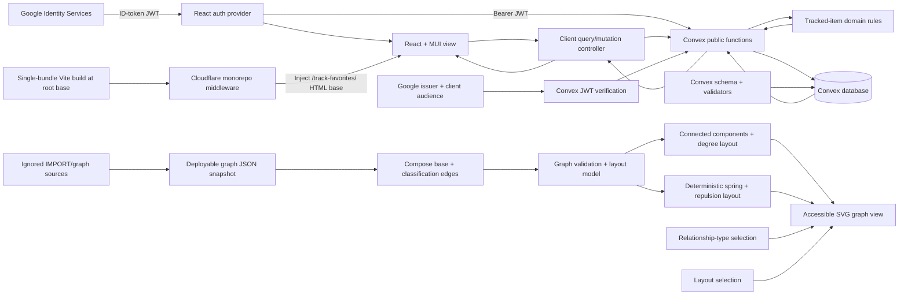
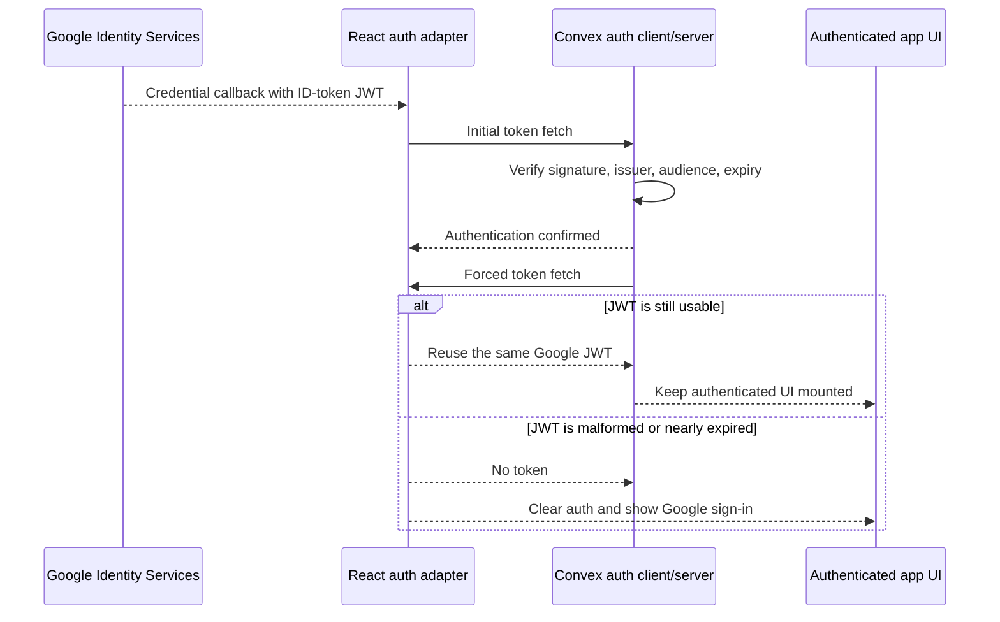

# Favorites Architecture

This document describes the implementation derived from `/KERNEL/`. The kernel remains authoritative.

## System design

The runnable project lives under `app/` for incorporation into the `codespaces-react` monorepo. Framework-independent rules live in `app/models/`; `app/convex/` authentication, queries, and mutations act as controllers around durable storage; `app/src/` contains the React and Material UI presentation. Google Identity Services supplies an ID-token JWT, `ConvexProviderWithAuth` sends it to Convex, and `convex/auth.config.ts` configures Google as the only accepted issuer and audience. Vite builds the app with `base: '/'`; the monorepo's Cloudflare middleware owns the production `/track-favorites/` mount and rewrites the initial HTML response.

The primary presentation is a spacious page organized into three levels: a strong page header with the Feneky and graph actions, a compact outlined add form, and a divider-based saved-links section. Link URLs receive the strongest visual emphasis; status controls and locally formatted update dates stay on the quieter second line. A relative `graph` route opens a dedicated, read-only knowledge-graph submodule. Its default layout renders connected components as separate SVG clusters, places high-degree hubs near cluster centers, moves low-degree entities toward cluster edges, and scales node circles by degree. A layout control offers a deterministic force-directed alternative in which relationship springs attract connected nodes while pairwise repulsion separates them. Relationship-type chips hide or restore edges without moving nodes, preserving the user's visual map while reducing clutter. `Is_a_Person` is composed from its own snapshot file but starts hidden and is omitted from both initial layout calculations so its shared `Person` target does not flatten the useful topology. Each chip and its centered, color-matched total form a compact filter column. Material UI supplies the palette, typography, inputs, dialogs, and responsive behavior, with CSS limited to layout and spacing.



## Monorepo route and asset boundary


### Asset routing

The standalone app remains unaware of the monorepo and uses Vite `base: '/'`,
matching the established `rands-personality-game` integration. In production,
`functions/_middleware.js` recognizes `track-favorites` as a valid app route,
and `.github/scripts/sync.sh` mirrors the upstream `app/` directory into the
monorepo. The middleware maps `/track-favorites/*` to the collected build and
rewrites root-relative entry assets in `index.html`.

That rewrite happens only to the initial HTML response. Vite's preload helper
for a lazy route embeds dependency paths inside the main JavaScript bundle and
prepends the configured root base at runtime. The original lazy graph therefore
requested `/assets/KnowledgeGraph-*.js` and CSS: the unprefixed JavaScript URL
returned a 404 without a MIME type even though the files existed at
`/track-favorites/assets/`.

The graph route now uses a static import, producing a single JavaScript bundle
and a single HTML-referenced stylesheet that middleware can rewrite safely. A
post-build verifier enforces the single-JavaScript-bundle constraint so a future
lazy import cannot silently reintroduce the production-only failure. App-owned
navigation continues to preserve the first `track-favorites` path segment with
relative links and suffix-based route parsing.

## Data model

`users` stores a unique indexed `userId` UUIDv1 string and an indexed Google `tokenIdentifier`. The token identifier is optional only to permit existing device-local user records to be claimed once during migration. `trackedItems` stores `userId`, the immutable exact submitted URL as `uniqueId`, one of the four valid statuses, required started and updated ISO date strings, and optional completed and cancelled ISO date strings.

Convex supplies `_id` and `_creationTime` system fields. They support storage mechanics but do not replace the kernel-required user ID, URL identity, or explicit ISO date fields.

The `by_token_identifier` index maps the verified Google identity to the kernel-required UUIDv1. Public tracked-item functions accept no user ID: they resolve ownership from `ctx.auth.getUserIdentity()` and reject missing or unregistered identities. On a first sign-in, the authenticated ensure mutation either claims the browser's existing unclaimed UUIDv1 record or creates a new one. This lets existing favorites survive the migration and makes later access independent of browser-local state.

The submitted URL is stored unchanged. The `by_user_and_unique_id` index finds exact duplicates efficiently; a user-scoped transactional comparison also removes one trailing path slash solely for duplicate detection. Duplicate insertion is rejected as an expected application error. The `by_user_id` index scopes reactive list queries to one authenticated user. The view orders its reactive result by modified date or URL ID without modifying persisted records.

## Authentication token lifecycle

Google's credential callback supplies a short-lived ID-token JWT. The React auth
provider stores it for the browser-tab session and gives it to
`ConvexProviderWithAuth`. Convex validates the token, reports authentication,
and then immediately performs a forced token fetch. Because Google Identity
Services does not provide a silent refresh-token API for this callback flow,
the adapter returns the same JWT when it is still usable. A forced fetch is a
request to bypass provider caching, not an instruction to sign out.



The regression observed during integration authenticated successfully and even
ran `users:ensure` and `trackedItems:list`, but the adapter interpreted the
immediate forced fetch as sign-out and dismantled the UI. Token selection now
lives in the framework-independent auth model and is tested for both normal and
forced fetches.

## User journey

```mermaid
sequenceDiagram
    actor User
    participant UI as Favorites UI
    participant Google as Google Identity Services
    participant API as Convex functions
    participant DB as Convex database

    User->>UI: Open the app
    UI->>Google: Request Google sign-in
    Google-->>UI: Return ID-token JWT
    UI->>API: Connect with bearer JWT
    API->>API: Verify issuer, audience, signature, expiry
    UI->>API: Ensure authenticated user exists
    API->>DB: Resolve token identifier
    alt Existing unclaimed browser UUIDv1
        API->>DB: Bind Google identity to existing user
    else Returning or new Google user
        API->>DB: Reuse or create UUIDv1 user
    end
    UI->>API: Subscribe to authenticated user's items
    API-->>UI: Loading, then current list
    User->>UI: Submit link and initial status
    UI->>API: Add exact URL string
    alt URL is new for this user
        API->>DB: Insert item and status dates
        DB-->>UI: Reactive list update
    else URL is already tracked
        API-->>UI: Helpful duplicate error
    end
    User->>UI: Sort or collapse the listing
    UI-->>UI: Reorder or hide rows locally
    User->>UI: Open View favorites graph
    UI-->>User: Navigate to relative graph route
    User->>UI: Follow typed entity relationships
    UI-->>User: Render clustered accessible SVG graph
    User->>UI: Select Force-directed layout
    UI-->>User: Reposition nodes using deterministic simulation
    User->>UI: Deselect a relationship type
    UI-->>User: Remove matching edges; keep nodes fixed
    User->>UI: Select Is a person
    UI-->>User: Show classification edges without recalculating node positions
    User->>UI: Select the relationship type again
    UI-->>User: Restore matching edges
    User->>UI: Return to favorites
    User->>UI: Choose a new status inline
    alt Status is unchanged
        UI-->>UI: No operation
    else Status is cancelled
        UI-->>User: Request confirmation
        User->>UI: Confirm cancellation
        UI->>API: Update to cancelled
        API->>DB: Set status, updated date, and cancelled date
        DB-->>UI: Reactive list-row update
    else Any other valid status
        UI->>API: Update status
        API->>DB: Set status, updated date, and relevant terminal date
        DB-->>UI: Reactive list-row update
    end
```

## Validation strategy

- Convex API tests prove UUIDv1 validation, idempotent users, exact and trailing-slash duplicate rejection, selectable initial status, same-status no-ops, ownership-scoped reads, ISO timestamps, and unrestricted status transitions.
- Authentication tests prove unauthenticated calls are rejected, one Google identity resolves idempotently, different Google identities remain isolated, and an existing unclaimed browser user retains its favorites when linked.
- JWT model tests prove display claims decode without treating them as authorization, valid JWTs survive Convex's immediate forced fetch, and expired credentials are rejected before being sent to Convex.
- Presentation tests prove the Feneky and graph header links, loading and empty feedback, exact URL and initial-status submission, duplicate feedback, Date/ID sorting, listing collapse, inline status changes, cancellation confirmation, graph rendering, default-off classification relationships, layout switching, relationship filtering, and absence of a detail panel.
- Graph model tests prove dangling relationships are rejected, all valid entities receive a layout position, connected entities cluster together, hubs sit inside their lower-degree neighbors, and the force-directed simulation is deterministic and bounded.
- TypeScript production builds verify the generated Convex data model and UI integration.
- ESLint and npm audit cover static quality and known dependency advisories.

## Current boundary

The app deliberately reuses Google's short-lived ID-token JWT and does not issue its own session, refresh token, or cookie. The token is held in session storage for reloads within the same browser tab and cleared shortly before expiry or on sign-out. Convex requests a forced token fetch immediately after confirming initial authentication; because this Google callback flow has no silent refresh-token API, the adapter returns the same JWT while it remains valid. An expired token returns the user to Google's explicit sign-in button so Google can issue a new credential. Authorization remains server-side: client-decoded name, email, and picture claims are display-only.
